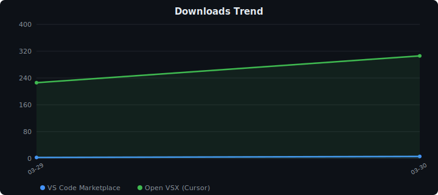

<p align="center">
  
</p>

<h1 align="center">Claude Code Exporter</h1>

<p align="center">
  <a href="https://marketplace.visualstudio.com/items?itemName=myoontyee.claude-code-exporter"></a>
  <a href="https://marketplace.visualstudio.com/items?itemName=myoontyee.claude-code-exporter"></a>
  <a href="https://marketplace.visualstudio.com/items?itemName=myoontyee.claude-code-exporter"></a>
  <a href="https://open-vsx.org/extension/myoontyee/claude-code-exporter"></a>
  <a href="https://github.com/Myoontyee/claude-code-exporter/blob/main/LICENSE"></a>
</p>

<p align="center">
  <a href="#english">English</a> · <a href="#中文">中文</a>
</p>

---

## English

### Why This Exists

I use Claude Code every day — across multiple projects, across dozens of sessions. And I kept running into the same wall.

**The session boundary problem.** Every new Claude Code session starts from zero. You explained your architecture last Tuesday. You debugged that auth issue on Thursday. You spent three hours building a shared mental model with Claude — and then the session ends, and it's gone. The next time you open Claude Code, it knows nothing.

Claude Code does have a built-in memory mechanism (CLAUDE.md, auto-compact summaries). But those summaries are lossy — they're compressed snapshots, not the full reasoning. When you need to reconstruct *why* a decision was made, or hand off context to a different tool, they fall short.

**The real pain: third-party API integration.**

This is where it gets sharper. If you're using Claude through a third-party API — whether that's a custom Claude integration, an OpenAI-compatible endpoint, or a platform that bills per token — you face a harder version of the same problem:

- **Each API call is stateless.** There is no "session" to resume. Every new request must carry its own context window.
- **You pay for every token you send.** Repasting a long conversation history every time is expensive. But not sending it means Claude has no memory of what you built together.
- **Conversation formats differ across providers.** Claude's native format, OpenAI's message array, raw text — they're all different. You can't just copy-paste a session from one tool into another.
- **Switching tools mid-project loses everything.** Move from Claude Code CLI to a web interface, or from one session to another, and the context evaporates.

The exported `.md` files solve this cleanly. They're **plain Markdown** — readable by any model, pasteable into any interface, editable before sending. You control exactly what context you include, in a format that works everywhere.

**Claude Code Exporter** does one thing: it automatically saves every conversation as a Markdown file, inside your project folder, in real time. Your sessions become a local knowledge base — searchable, portable, and model-agnostic.

> *Note: Claude Code's built-in autodream/memory features cover the single-tool case well. This extension is especially useful when you're crossing session boundaries, switching API providers, or building a persistent record that survives beyond any one tool.*

### How It Works

```
~/.claude/projects/<your-project>/session.jsonl
                      │
                      │  auto-detected + real-time file watching
                      ▼
         <your-project>/.cc-history/
              ├── 2025-03-27_143025_fix-auth-bug_a1b2c3d4.md
              ├── 2025-03-28_091530_refactor-api_e5f6g7h8.md
              └── ...
```

Open any workspace → extension matches it to its Claude sessions → exports to `.cc-history/` → watches for new messages and updates instantly. **Zero configuration.**

### Features

| Feature | Description |
|---|---|
| **Auto-export** | Exports to `.cc-history/` when you open a workspace. Updates in real time as you chat. |
| **Two formats** | **Readable** — rich Markdown with metadata and tool call details, for archiving. **Compact** — clean Human/Claude turns only, optimized for pasting back as context. |
| **Sidebar** | Browse all sessions for the current project. Click any session to preview. |
| **Batch export** | One-click export all sessions, or scan your entire machine for every Claude project. |
| **Smart filenames** | `{date}_{time}_{first-message}_{sessionId}.md` — sorted by second, find what you need at a glance. |
| **Tool summaries** | `[Tool: Bash — git status]` instead of raw JSON walls. |

### Quick Start

1. Install from the [VS Code Marketplace](https://marketplace.visualstudio.com/items?itemName=myoontyee.claude-code-exporter)
2. Open a project where you've used Claude Code
3. Done — check the `.cc-history/` folder in your project root

### Use as a Knowledge Base

Set format to **Compact**, then in a new Claude Code session:

```
Read .cc-history/2025-03-27_143025_fix-auth-bug_a1b2c3d4_compact.md
and use that context to continue the work.
```

Claude now has full context from the previous session. This is the closest thing to **persistent memory across sessions** that Claude Code currently supports.

### Settings

| Setting | Default | Description |
|---|---|---|
| `claudeCodeExporter.autoExport` | `true` | Auto-export on open and on changes |
| `claudeCodeExporter.exportFormat` | `readable` | `readable` for archiving, `compact` for AI context |
| `claudeCodeExporter.includeThinking` | `false` | Include extended thinking blocks |
| `claudeCodeExporter.includeToolDetails` | `true` | Include tool call details |
| `claudeCodeExporter.claudeProjectsDir` | `~/.claude/projects` | Custom Claude projects path |

### Compatibility

- VS Code 1.85+ · Cursor · Claude Code CLI · Claude Code for VS Code
- Windows / macOS / Linux

---

## 中文

### 为什么做这个插件

我每天都在用 Claude Code，跨多个项目，跨几十个会话。然后我一直撞上同一堵墙。

**会话边界问题。** 每次重开 Claude Code，一切从零开始。上周二解释了系统架构，周四调试了鉴权 bug，花了三个小时和 Claude 建立起完整的心智模型——然后会话结束了，什么都没了。下次打开 Claude Code，它什么都不知道。

Claude Code 本身有内置的记忆机制（CLAUDE.md、自动压缩摘要）。但那些摘要是有损的——它们是压缩快照，不是完整推理过程。当你需要还原"为什么当时做了这个决策"，或者把上下文迁移到别的工具时，摘要是不够的。

**真正的痛点：第三方 API 接入。**

如果你通过第三方 API 使用 Claude——无论是自建的 Claude 集成、兼容 OpenAI 格式的接口，还是按量计费的平台——你会遇到更难处理的同一个问题：

- **每次 API 调用都是无状态的。** 没有可以续接的"会话"，每次请求必须自带上下文。
- **你为每一个 token 付钱。** 每次把完整对话历史贴进去代价高昂；但不贴，Claude 就没有之前建立的记忆。
- **不同 API 的对话格式不一样。** Claude 原生格式、OpenAI 的 message 数组、纯文本——格式各异，无法直接跨工具复制粘贴。
- **中途换工具，上下文全丢。** 从 Claude Code CLI 切换到网页界面，或者重开一个会话，之前的一切就消失了。

导出的 `.md` 文件干净地解决了这个问题。它们是**纯 Markdown**——任何模型都能读，可以粘贴到任意界面，发送前可以手动编辑裁剪。你完全掌控要带入多少上下文，用一种到处都能用的格式。

**Claude Code Exporter** 只做一件事：自动把每段对话实时保存为 Markdown 文件，放在你的项目文件夹里。你的会话变成本地知识库——可搜索、可移植、与具体模型无关。

> *注：Claude Code 内置的 autodream / 记忆功能对单工具场景已经够用。这个插件在跨会话边界、切换 API 提供商、或需要一份超越任何单一工具的持久记录时，尤其有价值。*

### 工作原理

```
~/.claude/projects/<your-project>/session.jsonl
                      │
                      │  自动检测 + 实时文件监控
                      ▼
         <your-project>/.cc-history/
              ├── 2025-03-27_143025_fix-auth-bug_a1b2c3d4.md
              ├── 2025-03-28_091530_refactor-api_e5f6g7h8.md
              └── ...
```

打开任意工作区 → 插件自动匹配对应的 Claude 会话 → 导出到 `.cc-history/` → 实时监听新消息并更新。**零配置。**

### 功能

| 功能 | 说明 |
|---|---|
| **自动导出** | 打开工作区即导出，对话进行中实时更新 |
| **双格式** | **可读模式** — 完整 Markdown，含元数据和工具调用，用于存档。**精简模式** — 纯对话流，用于贴回给 Claude 作上下文 |
| **侧边栏** | 浏览当前项目的所有会话，点击直接预览 |
| **批量导出** | 一键导出全部会话，或扫描全机所有 Claude 项目 |
| **智能命名** | `{日期}_{时间}_{首条消息}_{会话ID}.md`，按秒排序，一眼找到想要的 |
| **工具摘要** | `[Tool: Bash — git status]` 替代大段 JSON |

### 快速开始

1. 从 [VS Code Marketplace](https://marketplace.visualstudio.com/items?itemName=myoontyee.claude-code-exporter) 安装，或在扩展搜索 "Claude Code Exporter"
2. 打开一个你用过 Claude Code 的项目文件夹
3. 完成——查看项目根目录下的 `.cc-history/` 文件夹

### 用作知识库

设置格式为 **Compact（精简模式）**，然后在新会话里：

```
Read .cc-history/2025-03-27_143025_fix-auth-bug_a1b2c3d4_compact.md
and use that context to continue the work.
```

Claude 就拥有了上一次会话的完整上下文。这是目前 Claude Code 能做到的最接近**跨会话持久记忆**的方案。

### 设置项

| 设置 | 默认值 | 说明 |
|---|---|---|
| `claudeCodeExporter.autoExport` | `true` | 打开项目和检测到变更时自动导出 |
| `claudeCodeExporter.exportFormat` | `readable` | `readable` 存档，`compact` 喂 AI |
| `claudeCodeExporter.includeThinking` | `false` | 包含扩展思考块 |
| `claudeCodeExporter.includeToolDetails` | `true` | 包含工具调用详情 |
| `claudeCodeExporter.claudeProjectsDir` | `~/.claude/projects` | 自定义 Claude 项目目录 |

### 兼容性

- VS Code 1.85+ · Cursor · Claude Code CLI · Claude Code for VS Code
- Windows / macOS / Linux

---

<p align="center">
  
</p>

<p align="center">
  <sub>Built for developers who talk to AI all day and don't want to lose those conversations.</sub><br>
  <sub>为每天和 AI 对话、又不想丢失这些对话的开发者而造。</sub>
</p>
